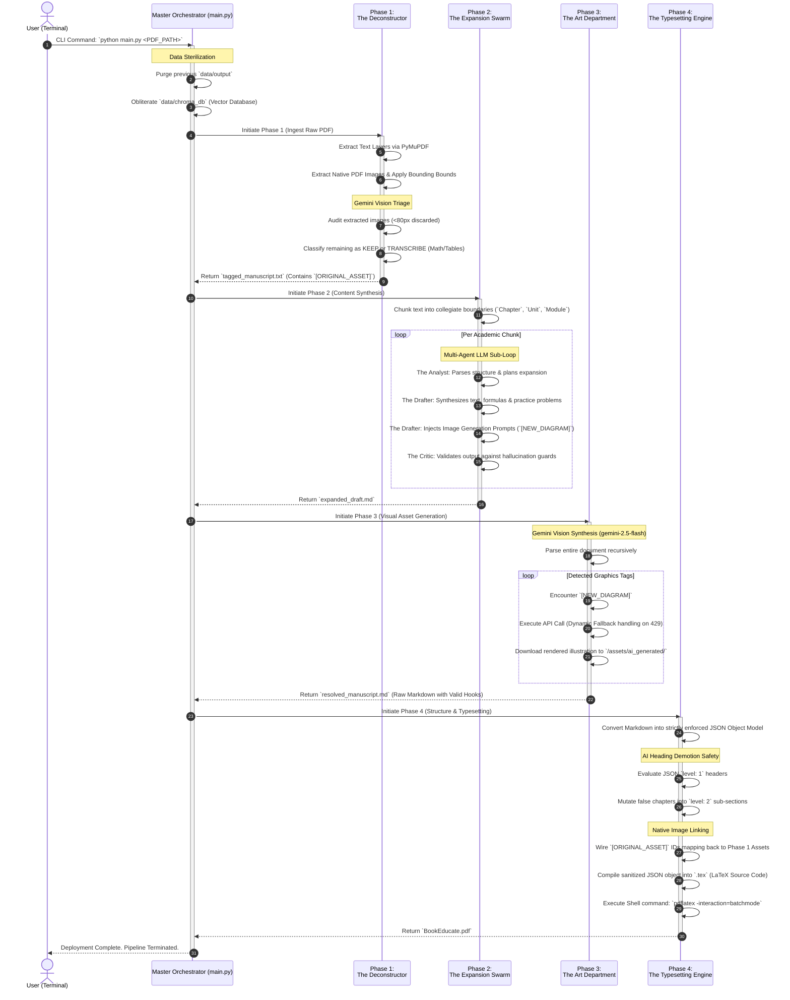

# 🌊 PROCESS FLOW DIAGRAM: BookEducate 5.0

This document visualizes the complete end-to-end execution lifecycle of the autonomous BookEducate pipeline. From initial user execution to PDF delivery, it maps out how the Orchestrator delegates tasks to the four critical agent phases.

